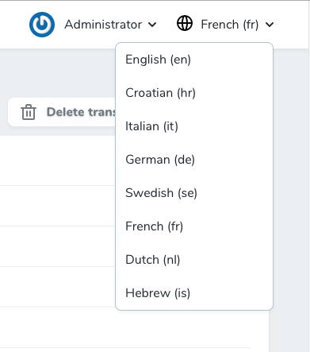

# Laravel Nova Locale Anywhere Tool

This tool provides a nice header dropdown to quickly switch between locales (this locales are independent of the `app()->getLocale()` value and are stored in cache).

It also provides a `Language` field which gives you the status of the translation on a specific resource.

## Installation

```
composer require sloveniangooner/locale-anywhere
```

## Usage

To begin using this, you must first register the tool in `NovaServiceProvider` under tools. The tool utilises Spatie's Laravel Translatable package.

```
public function tools()
{
    return [
        new LocaleAnywhere([
            "locales" => [
                "en" => "English",
                "de" => "German"
            ],
            "useFallback" => false,
        ])
    ];
}
```

### Define the field

You can then define the field in the resource.

```
use Sloveniangooner\LocaleAnywhere\Language;

Language::make("Language)
```


### Extend trait

You also have to overwrite Spatie's `HasTranslations` trait in your model to allow toggling fallback locale and apply custom locale instead of `app()->getLocale()`.
Don't worry - the package's trait extends all the functionalities Spatie's trait offers.

```
use Sloveniangooner\LocaleAnywhere\HasTranslations;
use Illuminate\Database\Eloquent\Model;

class Content extends Model {
    use HasTranslations;

    public $useFallback = true; // Local setting to use the fallback locale or not
}
```

For other options related to translations - please see Spatie's package. (spatie/laravel-translatable)[https://github.com/spatie/laravel-translatable]

### Dropdown

The package provides a switch for the languages that you have to insert into Nova's layout file. You can do that by overwriting the `layout.blade.php` file and insert it after the user dropdown.

```
<dropdown class="ml-auto h-9 flex items-center dropdown-right">
    @include('nova::partials.user')
</dropdown>

<locale-anywhere-dropdown class="ml-6"></locale-anywhere-dropdown>
```



### Delete translation toolbar button

The package provides a CustomDetailToolbar component that you can toggle via configuration. Optionally, you can also only grab the `<delete-toolbar-button>` from the package and paste it into your own custom detail toolbar.

```
new LocaleAnywhere(
    [
        "locales" => [
            "en" => "English",
            "de" => "German"
        ],
        "useFallback" => false,
        "customDetailToolbar" => false
    ]
)
```


